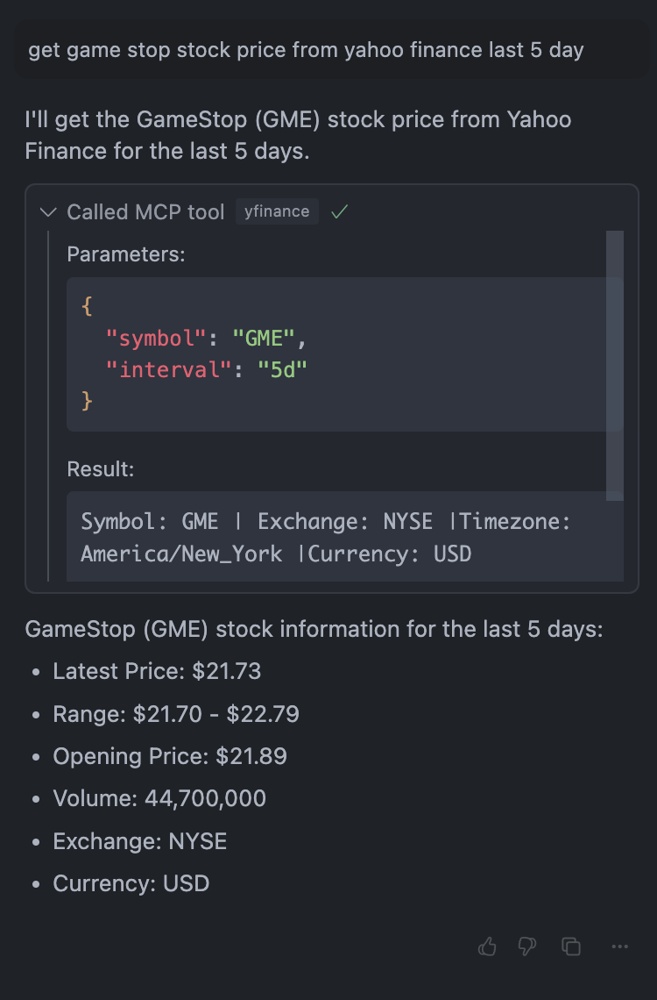

# Extism Go PDK Plugin

A [hyper-mcp](https://github.com/tuananh/hyper-mcp) plugin that retrieves stock pricing info from yahoo finance.

<p align="center">
  
</p>

## Usage

The tool accepts a single parameter:

- `project_name`: The name of the project to search for

- Add the plugin to your hyper-mcp configuration:

```json
{
  "plugins": [
    {
      "name": "yfinance",
      "path": "oci://ghcr.io/phamngocquy/hyper-mcp-yfinance:latest",
      "runtime_config": {
        "allowed_host": "query2.finance.yahoo.com"
      }
    }
  ]
}
```

See more documentation at https://github.com/extism/go-pdk and
[join us on Discord](https://extism.org/discord) for more help.
